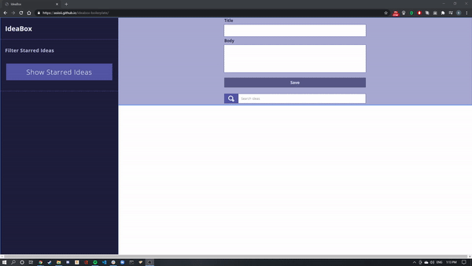

# IdeaBox
#### Keep your thinking outside the box, *store* your thinking inside the box.

- [view the deployed page](https://asiisii.github.io/ideabox-boilerplate/)

### Table of Contents
- [Overview](#overview-and-project-goals)
- [Features](#features)
- [How does this work?](#how-does-this-work)
- [Project Reflection](#project-reflection)
- [How To Contribute](#want-to-contribute)
- [Authors and Contributors](#credits)

###### (Quick Referece Resource List) :
###### - [DTR Gist](https://gist.github.com/asiisii/0df07c5bde6dd624e05df347219bfe42)
###### - [Deployed Link](https://asiisii.github.io/ideabox-boilerplate/)
###### - [Repo Link](https://github.com/asiisii/ideabox-boilerplate)
###### - [Project Spec/Rubric](https://frontend.turing.io/projects/module-1/ideabox-group.html)

## Overview and Project Goals
   The [goal](https://frontend.turing.io/projects/module-1/ideabox-group.html) behind IdeaBox was to build an application that would aid in channeling our creativity by giving us a space to store and sort through our ideas.

### Learning Goals
   Both our overaching group goal as well as our individually set goals (set in our [DTR](https://gist.github.com/asiisii/0df07c5bde6dd624e05df347219bfe42)) all seem to have been met with this project. The group goal being easiest to quantify; we set out to complete iteration 4 with no bugs. Ashish was seeking further understanding of data model vs DOM. Nichele's were to actually understand how (and why) to implement a class and to seek better understanding of the intersection of DOM and data model, and Plum's were to work towards increasing his general competence in HTML/CSS.

### Why was this project created?
   The ideabox project was intended to further our understanding of writing clean HTML & CSS to match a comp, implement client-side data persistence by utilizing JSON and localStorage, work with filters, keeping firm separation on data model vs DOM, and pushing towards writing DRY code as well as keeping SRP in mind.

## Features
   IdeaBox has a user input for a title and a body, a save button that will generate a card at the bottom of the page and commit it to localStorage (ergo persisting on page load), a search bar to filter through said cards, a favoriting option (utilizing a recolor of the star icon on each individual card) that has a corresponding button that will show only cards that you've favorited, as well as the ability for a user to delete any cards they may have created.

## How does this work?

- First the user enters whatever text they want in both the `Title` and `Body` sections and clicks the `Save` button to add a new card to the bottom of their page. Once saved to the bottom of the page, the user can favorite their new idea card by clicking the `Star` icon on the card, delete by clicking the `X` icon on the card, and filter in two ways; either by typing text into the `Search Bar`, or filtering by favorites using the `Show Starred Ideas` button located on the left side of the screen.

#### (*Note: The save button will only become clicable once the user has entered text in *both* the title and body sections.) 

#### Search Filter in action:

#### Show Favorites in action:

## Want to contribute?
Provide instructions for how users can fork/clone the repo and contribute to the project
If you'd like to contribute, please fork this repository and clone it down to your local machine. Once you've successfully implemented the changes in code necessary for your intended contribution without changing any of the current functionality of main, contact one of the authors to review the changes.

### Technologies Used
Github Pages used for app deployment and project board, GH used to handle the repository.

## Project Reflection

##### Wins
Overall wins - what went really well?

We finished our project along the time scale we set in our goals, finishing iteration 4 with enough time to refactor, clean up and review in the way that we wanted. We believe we wrote fairly DRY code in accordance with SRP. We followed our DTR in spirit and implementation quite successfully as well. We learned a ton of information working on this project together and still had time throughout to allow ourselves to practice with test prep.

##### Challenges

Overall challenges - what could have gone better?

We could have been more intentional about defining a successful schedule, more specifically decide on when we should be writing code as a team rather than individually which resulted in some merge challenges and additional time spent refactoring. Implementing localStorage was difficult, despite it's technical steps being straightforward and consistent.

##### Overall Impressions

We enjoyed working on this project together and think that the product we came up with is in line with what we wanted to get out of it.

#### Future Features

What's next for this project?

Next iteration : 5 - Commenting on Ideas:
- Add functionality to the comment section of idea cards.

## Credits
#### Authors
<table>
    <tr>
        <td> Ashish Malla <a href="https://github.com/asiisii">GH</td>
         <td> Nichele D <a href="https://github.com/nichelicorn">GH</td>
         <td> Daniel Plummer <a href="https://github.com/bearfrowns">GH</td>
    </tr>
    </tr>
    <td></td>

<td></td>

<td></td>
</tr>
</table>

##### Co-Contributors
####Thank you for your contributions!
- For entertaining late night project conversations: [Jim Charmesky](https://github.com/bigbike96)

##### Project Manager
<table>
    <tr>
         <td> Heather Faerber <a href="https://github.com/hfaerber">GH</td>
    </tr>
    </tr>
    <td></td>
</tr>
</table>

**************************************************************************
###### This project was created for [Turing School of Software and Design](https://turing.io/)
###### 2021/03/02
